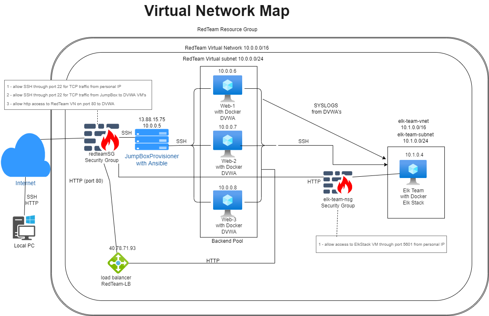
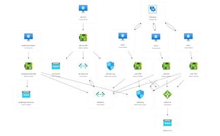
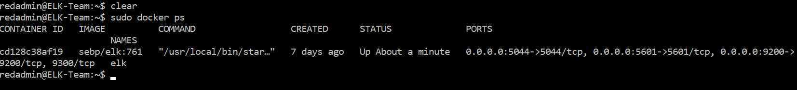
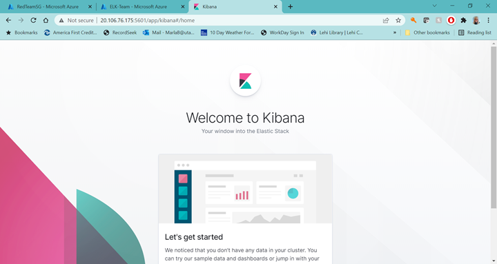
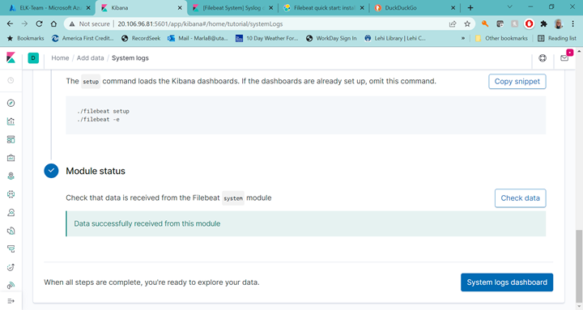
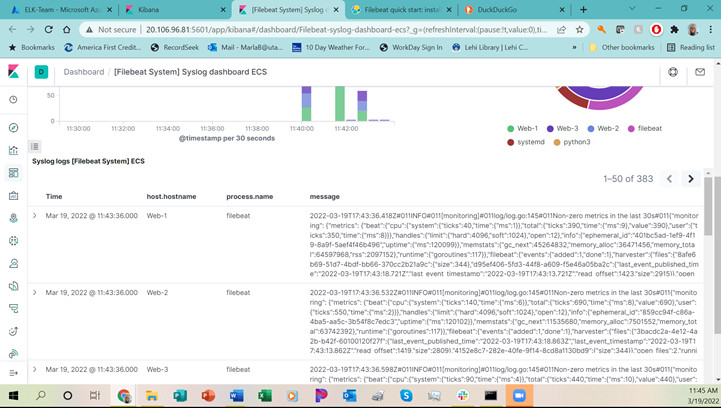
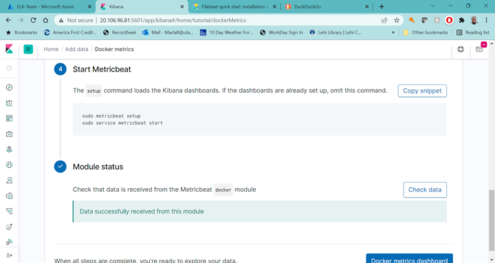
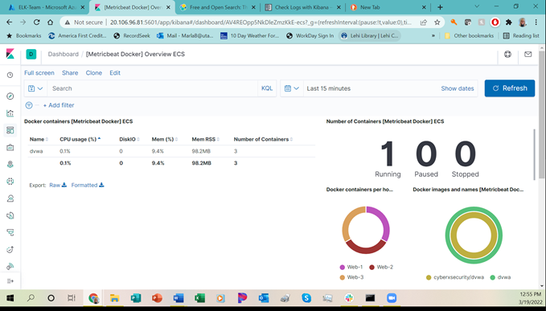

This Project encapsulates the process of creating virtual networks and securing them.
Additionally, it highlights my ability to create both Bash and YAML scripts. While the Bash scripts were not directly related to the virtual network project,
they were included as an additional skill set.

The Bash scripts included were for a basic backup of a system as well as the process of research.
The research was for a project related to an imaginary casino and questionable activity.
 - The project was to find the the specific games that were played during high losses and compare
   that to the dealers for those games. 
 - The scripts created were to compare variable times and games based on the logs holding that information.

The YAML scripts were for creating a virtual network with an ELK stack machine; specifically with Filebeats and Metricbeats.
## Automated ELK Stack Deployment

The files in this repository were used to configure the network depicted below.

[Network diagram] https://github.com/marbran3/Project-1/blob/e7302369218a59b90925c5cbb185fd148790dbdb/Diagrams/Project_13_Diagram.drawio.png

[Resource Group Visualization] https://github.com/marbran3/Virtual-Network-Project/blob/3bff8f7e596c1fa31e2c71dc2ecf9e377ac8b0a0/Diagrams/RedTeam_Resource_Group.png

These files have been tested and used to generate a live ELK deployment on Azure. They can be used to either recreate 
the entire deployment pictured above. Alternatively, select playbooks may be used to install only certain pieces of it, such as Filebeat, see the filebeat-playbook.yml

[Ansible Directory] https://github.com/marbran3/Project-1/blob/47311df3f915d667bd70b634f53bb2043e3ac0c6/Ansible/
- Ansible configuration
- Ansible ELK installation and VM Configuration
- Ansible Filebeat configuration
- Ansible Filebeat playbook
- Ansible Metricbeat configuration
- Ansible Metricbeat playbook

This document contains the following details:
- Description of the Topology
- Access Policies
- ELK Configuration
  - Beats in Use
  - Machines Being Monitored
- How to Use the Ansible Build

### Description of the Topology

The main purpose of this network is to expose a load-balanced and monitored instance of DVWA, the D*mn Vulnerable Web Application.

Load balancing ensures that the application will be highly available, in addition to restricting external access to the network. 
A load balancer allows the ability to redirect traffic so no one machine/server is overburdened. This helps improve service availability
and prevent downtime by reducing risk of DDoS attacks. 

Using a jump box protects the virtual machines from external access through the internet, thereby reducing the risk of attack. You are able
to access and manage devices in a more secure zone. Setting up Docker on the jumpbox allows for continuity among all new machines setups. 

Integrating an ELK server allows administrators to easily monitor the VM's running DVWA for changes to the logs and system traffic. Filebeat monitors and 
collects log files and fowards them to Elasticsearch for indexing, making them easier to monitor. Metricbeat records metrics and statistics
about the system and services running. This gives the ability to quickly execute searches to monitor activity. Additionally, Metricbeats assists with visualizations
with graphs and charts, etc.

The configuration details of each machine may be found below.

| Name               | Function     | IP Address | Operating System |
|--------------------|--------------|------------|------------------|
| JumpBoxProvisioner | Gateway      | 10.0.0.5   | Ubuntu 18.04     |
| Web-1              | DVWA         | 10.0.0.6   | Ubuntu 18.04     |
| Web-2              | DVWA         | 10.0.0.7   | Ubuntu 18.04     |
| Web-3              | DVWA         | 10.0.0.8   | Ubuntu 18.04     |
| ELK-Team           | Monitoring   | 10.1.0.4   | Ubuntu 18.04     |

## Access Policies

The machines on the internal network are not exposed to the public Internet. 

Only the JumpBoxProvisioner machine can accept connections from the Internet. Access to this machine is only allowed from
the following IP addresses: my personal IP

Machines within the network can only be accessed by the JumpBoxProvisioner, IP 13.88.15.75. The jumpbox connects via SSH to the DVWA servers and the Elk-Team server.

A summary of the access policies in place can be found in the table below.

| Name               | Publicly Accessible | Allowed IP Addresses |
|--------------------|---------------------|----------------------|
| JumpBoxProvisioner | Yes                 |  my personal IP      |
| Web-1              | No                  |  10.0.0.5            |
| Web-2              | No                  |  10.0.0.5            |           
| Web-3              | No                  |  10.0.0.5            |
| ELK-Team           | No                  |  10.0.0.5            |

### Elk Configuration

Ansible was used to automate configuration of the ELK machine. No configuration was performed manually, which is advantageous because 
we are able to ensure continuity among all the scripts. By using Ansible, we are able to ensure all machines do the exact same thing
every time, eliminating as much variability in configuration. 

[install-elk.yml] https://github.com/marbran3/Project-1/blob/47311df3f915d667bd70b634f53bb2043e3ac0c6/Ansible/install-elk.yml

The playbook implements the following tasks:
- Identify target machines.
- Installs the Docker engine which is used for running containers on each server.
- Installs the use of python3, so the system doesn't need to search its own version of python.
- Installs Docker python modules.
- Increases the memory size, since ELK servers requires more.
- Downloads the ELK container and specifies the ports to be used.
- Automatically starts the ELK container, so the service starts automatically.

The following screenshot displays the result of running `sudo docker ps` after successfully configuring the ELK instance.

### Target Machines & Beats
This ELK server is configured to monitor the following machines:
  10.0.0.6
  10.0.0.7
  10.0.0.8

We have installed the following Beats on these machines:
  Filebeats
  Metricbeats

These Beats allow us to collect the following information from each machine:
- Filebeat - collects system logs and ships them to Elasticsearch.
- Metricbeat - collects metrics and statistics, such as CPU usage and uptime, about the network and sends them to Elasticsearch for easier monitoring.
   - Metricbeat can be used to monitor ssh logins and failed sudo escalations.

### Using the Playbook
In order to use the playbook, you will need to have an Ansible control node already configured. Assuming you have such a control node provisioned: 

[filebeat-playbook] https://github.com/marbran3/Project-1/blob/47311df3f915d667bd70b634f53bb2043e3ac0c6/Ansible/filebeat-playbook.yml

[metricbeat-playbook] https://github.com/marbran3/Project-1/blob/47311df3f915d667bd70b634f53bb2043e3ac0c6/Ansible/metricbeat-playbook.yml

SSH into the control node and follow the steps below:
- download and unzip the config file from elastic.co.
- Copy the  file from the ansible container to /etc/ansible/files.
- Enable and configure docker modules on DVWA's
- Setup filebeat/metricbeat
- Start filebeat/metricbeat
- Enable startup of services on boot

- After download of config file, update the hosts file to include IP addresses for the webservers and the ELK server
- Install filebeat-playbook.yml and metricbeat-playbook.yml and navigate to http://{ELK machine internal IP}:5601/app/kibana

###Verfication of working Kibana
[images file] https://github.com/marbran3/Project-1/blob/47311df3f915d667bd70b634f53bb2043e3ac0c6/Images/Kibana_screen_shot.png

The commands below can be used to download the playbook, update the files, and run the playbooks_
- Edit the hosts file to include new ELK IP address: nano /etc/ansible/hosts
- Create a new playbook to install ELK: nano /etc/ansible/install-elk.yml
- Run the install-elk playbook: playbook-ansible install-elk.yml
- Verify Elk is working: from a browser, http://{ELK machine IP}:5601/app/kibana
- Download filebeat config file: 
 curl https://gist.githubusercontent.com/slape/5cc350109583af6cbe577bbcc0710c93/raw/eca603b72586fbe148c11f9c87bf96a63cb25760/Filebeat > /etc/ansible/filebeat-config.yml
- Edit config file with correct IP address: nano /etc/ansible/filebeat-config.yml
  - do not change the user id or password
- Create filebeat playbook: nano /etc/ansible/roles/filebeat-playbook.yml
  - Edit the playbook with the following commands, using the most updated filebeat version according to https://www.elastic.co/guide/en/beats/filebeat/current/filebeat-installation-configuration.html for the current download.
    - curl -L -O https://artifacts.elastic.co/downloads/beats/filebeat/filebeat-7.6.1-amd64.deb
    - sudo dpkg -i filebeat-7.6.1-amd64.deb
    - copy: src: {from location} dest: {to location}
    - filebeat modules enable system
    - filebeat setup
    - service filebeat start
    - systemd: filebeat yes
- Run the filebeat playbook: ansible-playbook filebeat-playbook.yml
- Create metricbeat playbook: nano /etc/ansible/roles/metricbeat-playbook.yml
  - follow similar steps to filebeat using the below commands to download, install, copy, enable & configure, setup and start metricbeat on boot
    - curl -L -O https://artifacts.elastic.co/downloads/beats/metricbeat/metricbeat-7.6.1-amd64.deb
    - sudo dpkg -i metricbeat-7.6.1-amd64.deb
    - copy: src {location} dest {location}
    - metricbeat modules enable docker
    - metricbeat setup
    - service metricbeat start
    - systemd: metricbeat yes
- Run the metricbeat playbook: ansible-playbook metricbeat-playbook.yml

To upload documentaion to a github file:
- git clone https://github.com/your-username/yourlink.git
- git add .
- git commit -m "First commit"
- git push
